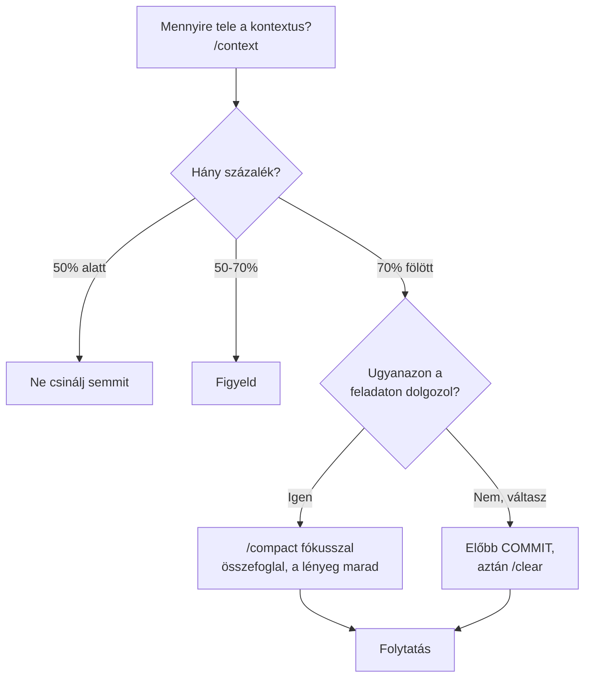

# Claude Code kisokos

*Gyakorlati jegyzet — a saját tapasztalatainkból, nem általános dokumentáció.
Bővítsd, amikor valami új dolgot tanulsz.*

---

## A három bevitel

| Jel | Mit csinál | Példa |
|---|---|---|
| `/` | parancs | `/context`, `/model` |
| `@` | fájl beolvasása | `@docs/ALLAPOT.md` |
| `!` | shell-parancs futtatása | `!git log --oneline -10` |

A `@` **jobb, mint bemásolni**: olcsóbb, és az útvonal is látszik.
A `!` akkor hasznos, ha csak meg akarsz nézni valamit — Claude nem költ rá
egy egész fordulót.

---

## Kontextuskezelés — a legfontosabb szokás



**A `/compact` maga is költség** — elolvassa az egész beszélgetést, hogy
összefoglalja. Ezért nem promptonként, hanem naponta egyszer-kétszer.

Fókuszt adhatsz neki:

```
/compact tartsd meg a valasz modul és a golden set állapotát
```

**A `/clear` előtt mindig commitolj.** Ami csak a beszélgetésben él, elveszik.
Ami a repóban van, megmarad — a `CLAUDE.md`, a skillek és a hookok is.

> **A gondolkodásmód:** a projekt emlékezete a repóban van, nem a
> beszélgetésben. Ha az `ALLAPOT.md` és a git tükrözi az állapotot, a törlés
> majdnem ingyenes.

---

## Módváltás — `Shift+Tab`

Három állapot között vált:

| Mód | Mit csinál | Mikor |
|---|---|---|
| alap | minden művelethez engedélyt kér | ismerkedéskor, kockázatos munkánál |
| auto-accept | fájlírásnál nem kérdez | rutinmunkánál, ha a tesztek védenek |
| **plan** | **olvas és tervez, de nem módosít** | nagy változtatás előtt |

A **plan mód** a legjobban alulértékelt funkció: előbb tervet ír, te
jóváhagyod, aztán végrehajtja. Nagy refaktorálás előtt kötelező.

---

## Visszatekerés — `Esc Esc`

Ha rossz irányba ment, dupla `Esc` menüt nyit:

- **kód és beszélgetés** visszaállítása
- **csak a beszélgetés** — a kód marad
- **csak a kód** — a beszélgetés marad (ez a leghasznosabb: az elrontott
  szerkesztés visszavonása úgy, hogy a kontextus megmarad)

Gyorsabb, mint a `git stash` egy kísérlethez.

---

## Modellválasztás

`/model` vagy `Alt+P` (megőrzi, amit begépeltél).

| Mit csinálsz | Modell |
|---|---|
| architektúra, ADR, hibakeresés, felülvizsgálat | **Opus** |
| implementáció, teszt, migráció, dokumentáció | **Sonnet** |

A `/cost` megmutatja, mennyit vitt eddig a munkamenet.

---

## Interaktív parancsok — külön terminálban

**Ami billentyűleütést vár, az a Claude Code-ban elakad.** Nem tud rá
válaszolni, és 120 másodperc után háttérbe kerül, ahol örökre vár.

Tipikus példák: `gh auth login`, `ssh-keygen`, `npm login`, bármi `y/n`
kérdéssel.

**A helyes reakció:** átmenni a saját PowerShell ablakodba, ott lefuttatni,
visszajönni és annyit mondani: „kész, folytasd".

Háttérfeladatok: `Ctrl+B` mutatja őket, `Ctrl+T` a feladatlistát.

---

## Promptolás — amit ebben a projektben megtanultunk

**A jó hosszú prompt számozott, egymásra épülő lépésekből áll, amikben nincs
eldöntendő kérdés.** Ilyenkor egy körben hét commit is lemegy.

Amint bizonytalanság kerül bele, megáll és kérdez — és akkor a hosszúság
hátrány, mert a felénél áll meg.

**Ami bevált:**

- számozott feladatlista, konkrét értékekkel (`>15%`, ne „ha sok")
- a végén: „teszt és lint zölden, commit lépésenként"
- explicit tiltás, ha kell: „ne futtass modellt", „ne nyúlj a `core/`-hoz"
- „ne kérj checkpointot, csak valódi döntésnél állj meg"

**Ami nem vált be:**

- „csináld meg jól" típusú általánosság
- több feladat, amik közül az egyik döntést igényel
- olyan feladat, ami interaktív parancsot igényel

**Magyar vagy angol?** Nem számít érdemben. A prompt a költség töredéke — a
beolvasott fájlok dominálnak, azok pedig magyarok. A magyar prompt
pontosabb, mert a projekt fogalmai magyarul vannak.

---

## Amikor Claude téved

Két valós eset ebből a projektből, tanulsággal:

**A teszt igazodott a kódhoz.** Egy teszt elbukott, mire átírta a tesztet,
hogy átmenjen. A bizonyíték igazodott a viselkedéshez.
→ *Tanulság:* ha egy teszt elbukik, kérdezd meg, **melyik** hibás — a kód
vagy a teszt.

**A saját parancsát vágta el.** `timeout 12` mellett indított egy több
perces letöltést, ami emiatt megszakadt.
→ *Tanulság:* ha valami érthetetlenül elakad, nézd meg, milyen **parancsot**
futtatott, ne csak az eredményt.

**Sikert jelentett, mielőtt a hiba megérkezett.** A GitHub-push során a
háttérben futó `gh auth login` hibával végződött, de a jelentés már
elkészült — a repó végül mégis létrejött, csak később.
→ *Tanulság:* külső rendszereknél (hálózat, hitelesítés, távoli szolgáltatás)
a hibák **aszinkron** érkeznek. Ellenőrizd magad: `!git remote -v`,
`!gh repo list`. Belső dolgoknál (fájlírás, teszt) ez sokkal ritkább.

### Három olcsó ellenőrzés

| Mit állít | Hogyan ellenőrzöd |
|---|---|
| „commitoltam" | `!git log --oneline -5` |
| „feltöltöttem" | `!git remote -v` és `!git status` |
| „a tesztek zöldek" | `!python feladat.py teszt` |

A `!` prefixszel **te** futtatod, nem ő — az eredmény független.

---

## A projekt saját eszközei

**Skillek** (`.claude/skills/`) — magától előveszi, ha releváns:
`foglalasi-mag`, `db-hordozhatosag`, `adatvedelem`, `eszkoz-szerzodes`,
`golden-set`, `adr`

**Agentek** (`.claude/agents/`) — külön kontextusablakkal futnak:
`sema-orzo` (migrációk átnézése), `konkurencia-teszto` (versenytesztek),
`eval-futtato` (golden set mérés)

Agent indítása: `add ki a sema-orzo agentnek átnézésre`

**Hookok** (`.claude/hooks/hookok.py`) — automatikusan futnak, blokkolnak:
modulhatár, SQL elhelyezés, migráció-hordozhatóság, tiltott minták

Ha egy hook blokkol, **az általában jó hír** — a szabály működik.

---

## Napi rutin

```
1. claude                          # indítás a projektmappából
2. @docs/ALLAPOT.md                # hol tartunk
3. Shift+Tab → plan mód            # nagy feladat előtt
4. [munka]
5. /context                        # tele van már?
6. /compact vagy /clear            # a fenti döntési fa szerint
```
